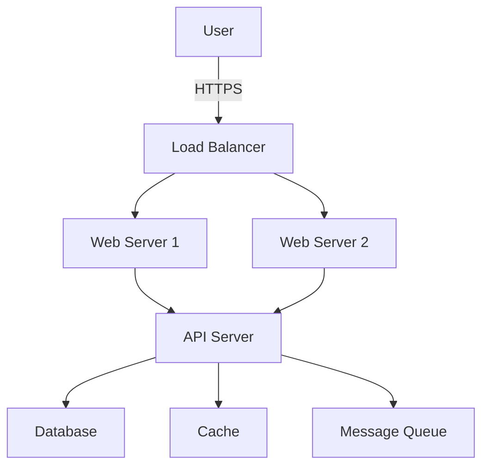
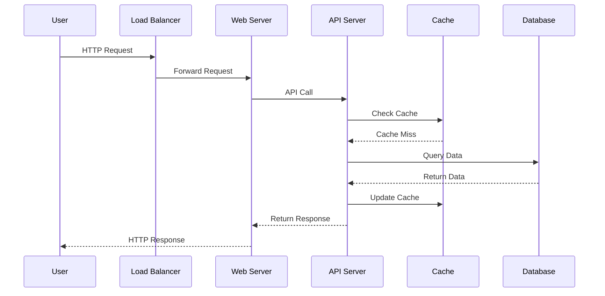

# Architecture Overview: [System Name]

**Version:** X.Y.Z
**Last Updated:** YYYY-MM-DD
**Status:** [Current | Proposed | Deprecated]
**Audience:** [Developers | Architects | Operations | All]

## Executive Summary

<!-- 2-3 paragraph high-level overview for non-technical stakeholders -->

Brief description of the system and its purpose. What does it do? Who uses it? Why does it exist?

**Key Points:**
- Key point 1
- Key point 2
- Key point 3

## System Context

<!-- Where does this system fit in the larger ecosystem? -->

### Purpose

What problem does this system solve?

### Users

Who are the primary users?
- User type 1 (e.g., End users)
- User type 2 (e.g., Internal teams)
- User type 3 (e.g., External partners)

### Dependencies

What does this system depend on?
- External service 1
- External service 2
- Internal system 1
- Third-party API 1

### Dependents

What depends on this system?
- System 1
- System 2
- System 3

## Architecture Diagram

<!-- High-level architecture diagram showing major components -->

```
┌─────────────┐
│   Users     │
└─────┬───────┘
      │
      ▼
┌─────────────────────────────────────┐
│         Load Balancer               │
└─────────────┬───────────────────────┘
              │
      ┌───────┴───────┐
      ▼               ▼
┌───────────┐   ┌───────────┐
│  Web App  │   │  Web App  │
│  Server   │   │  Server   │
└─────┬─────┘   └─────┬─────┘
      │               │
      └───────┬───────┘
              ▼
      ┌───────────────┐
      │   API Layer   │
      └───────┬───────┘
              │
      ┌───────┴────────┬─────────────┐
      ▼                ▼             ▼
┌──────────┐   ┌──────────┐   ┌──────────┐
│ Database │   │  Cache   │   │  Queue   │
└──────────┘   └──────────┘   └──────────┘
```

**Note:** Use Mermaid, PlantUML, or image files for more complex diagrams.

### Mermaid Example



## Components

<!-- Detailed description of each major component -->

### Component 1: [Name]

**Purpose:** What this component does

**Technology:** Technology/framework used

**Responsibilities:**
- Responsibility 1
- Responsibility 2
- Responsibility 3

**Interactions:**
- Calls: Component X, Component Y
- Called by: Component Z
- Events: Publishes event A, Subscribes to event B

**Key Interfaces:**
- Interface 1: Description
- Interface 2: Description

**Deployment:**
- Where it runs (e.g., AWS ECS, Kubernetes)
- Scaling strategy
- High availability setup

---

### Component 2: [Name]

**Purpose:** What this component does

**Technology:** Technology/framework used

**Responsibilities:**
- Responsibility 1
- Responsibility 2

**Interactions:**
- Calls: Component X
- Called by: Component A

**Key Interfaces:**
- Interface 1: Description

**Deployment:**
- Deployment details

---

### Component 3: [Name]

**Purpose:** What this component does

**Technology:** Technology/framework used

**Responsibilities:**
- Responsibility 1
- Responsibility 2

**Interactions:**
- Interactions

**Deployment:**
- Deployment details

## Data Flow

<!-- How data moves through the system -->

### Primary Flow: [Use Case Name]

1. **User Action:** User initiates [action]
2. **Load Balancer:** Routes request to available web server
3. **Web Server:** Validates request, calls API
4. **API Server:** Processes business logic
5. **Database:** Retrieves/stores data
6. **Cache:** Checks/updates cache
7. **Response:** Returns result to user

**Diagram:**


### Secondary Flow: [Use Case Name]

Description of another important data flow.

## Technology Stack

<!-- Technologies used across the system -->

### Frontend
- Framework: React 18.x
- State Management: Redux
- Build Tool: Vite
- UI Library: Material-UI

### Backend
- Language: Node.js 20.x
- Framework: Express 4.x
- API: REST
- Authentication: JWT

### Data Stores
- Primary Database: PostgreSQL 15.x
- Cache: Redis 7.x
- Search: Elasticsearch 8.x
- Object Storage: AWS S3

### Infrastructure
- Cloud Provider: AWS
- Container Orchestration: Kubernetes
- CI/CD: GitHub Actions
- Monitoring: Datadog

### Third-Party Services
- Payment Processing: Stripe
- Email: SendGrid
- Analytics: Mixpanel

## Scalability

<!-- How the system scales -->

### Current Scale
- Requests per second: ~1,000
- Data size: ~500 GB
- Active users: ~100,000
- Geographic regions: US, EU

### Scaling Strategy

**Horizontal Scaling:**
- Web servers: Auto-scale based on CPU (2-10 instances)
- API servers: Auto-scale based on request queue (3-15 instances)

**Vertical Scaling:**
- Database: Currently db.r5.2xlarge, can scale to db.r5.8xlarge

**Data Scaling:**
- Database: Read replicas for read-heavy workloads
- Cache: Redis cluster with automatic sharding
- Files: S3 with CloudFront CDN

### Bottlenecks

Known bottlenecks and mitigation plans:
- Bottleneck 1: Database writes → Solution: Write-through caching
- Bottleneck 2: API rate limiting → Solution: Queue-based processing

## Security

<!-- Security architecture overview -->

### Authentication & Authorization
- Method: OAuth 2.0 + JWT tokens
- Session management: Redis-backed sessions
- MFA: TOTP-based 2FA available

### Network Security
- All traffic over HTTPS (TLS 1.3)
- WAF: AWS WAF with custom rules
- DDoS Protection: CloudFlare

### Data Security
- Encryption at rest: AES-256
- Encryption in transit: TLS 1.3
- PII handling: Encrypted fields in database
- Secrets management: AWS Secrets Manager

### Compliance
- Standards: SOC 2 Type II, GDPR
- Audit logging: All data access logged
- Data retention: 90 days

## Resilience

<!-- How the system handles failures -->

### High Availability
- Multi-AZ deployment for all components
- Database: Primary + 2 read replicas
- Load balancers: Active-active configuration
- Auto-healing: Kubernetes restarts failed pods

### Disaster Recovery
- RTO: 4 hours
- RPO: 15 minutes
- Backup strategy: Daily full, hourly incremental
- DR region: Warm standby in us-west-2

### Error Handling
- Circuit breakers: Hystrix for external service calls
- Retries: Exponential backoff with jitter
- Graceful degradation: Core features work even if auxiliary services fail

### Monitoring & Alerting
- APM: Datadog
- Logging: ELK Stack
- Metrics: Prometheus + Grafana
- Alerting: PagerDuty integration

## Performance

<!-- Performance characteristics -->

### SLAs
- Availability: 99.9% uptime
- Response time: p95 < 200ms, p99 < 500ms
- Error rate: < 0.1%

### Optimization Strategies
- Database query optimization and indexing
- Redis caching for frequently accessed data
- CDN for static assets
- Lazy loading and code splitting in frontend

### Performance Bottlenecks
- Known bottleneck 1 and mitigation
- Known bottleneck 2 and mitigation

## Deployment

<!-- How the system is deployed -->

### Environments
- **Development:** Local development
- **Staging:** Pre-production testing
- **Production:** Live system

### Deployment Strategy
- Method: Blue-green deployment
- Frequency: Multiple times per day
- Rollback time: < 5 minutes
- Canary deployments: 10% → 50% → 100%

### Infrastructure as Code
- Tool: Terraform
- Repository: [Link to IaC repo]
- Change process: PR review + automated validation

## Cost

<!-- Cost overview -->

### Monthly Operating Costs
- Compute: $X,XXX
- Data storage: $XXX
- Data transfer: $XXX
- Third-party services: $XXX
- **Total:** $X,XXX per month

### Cost Optimization
- Reserved instances for predictable workloads
- S3 lifecycle policies for old data
- Auto-scaling to match demand

## Future Considerations

<!-- Planned architectural changes -->

### Near Term (3-6 months)
- Migration 1: Move to microservices architecture
- Upgrade 1: Upgrade to PostgreSQL 16
- Feature 1: Add GraphQL API layer

### Long Term (6-12 months)
- Migration 2: Multi-region active-active
- Feature 2: Real-time event streaming
- Optimization 1: Implement service mesh

## Decision Log

<!-- Links to relevant ADRs -->

Key architectural decisions:
- [ADR-0001: Choice of PostgreSQL](../adr/0001-postgresql.md)
- [ADR-0002: Microservices vs Monolith](../adr/0002-microservices.md)
- [ADR-0003: AWS vs GCP](../adr/0003-aws.md)

## References

<!-- Additional resources -->

- [API Documentation](../api/api-overview.md)
- [Database Schema](../database/schema.md)
- [Deployment Guide](../runbooks/deployment.md)
- [Monitoring Dashboard](https://monitoring.example.com)
- [Architecture Diagrams](https://diagrams.example.com)

## Glossary

<!-- Define technical terms and acronyms -->

- **CDN:** Content Delivery Network
- **JWT:** JSON Web Token
- **RTO:** Recovery Time Objective
- **RPO:** Recovery Point Objective
- **WAF:** Web Application Firewall

---

## Template Usage Notes

### When to Create Architecture Documentation

Create architecture documentation:
- At project start (initial architecture)
- After major architectural changes
- When onboarding new you
- For knowledge transfer
- For stakeholder communication

### Architecture Documentation Best Practices

- **Use diagrams:** Visual representations are crucial
- **Keep current:** Update when architecture changes
- **Multiple levels:** High-level for executives, detailed for developers
- **Link to ADRs:** Connect to decision documentation
- **Be honest:** Document trade-offs and technical debt
- **Show data flow:** Explain how information moves through system
- **Include scale:** Show current and expected scale

### Diagram Tools

Recommended tools:
- **Mermaid:** Markdown-based, version-controlled
- **PlantUML:** Code-based diagrams
- **draw.io:** Visual editor
- **Lucidchart:** Collaborative diagramming
- **CloudCraft:** Cloud architecture diagrams

### Keeping Documentation Current

- Review quarterly
- Update when architecture changes
- Link from code comments
- Include in onboarding
- Make it part of ADR process
