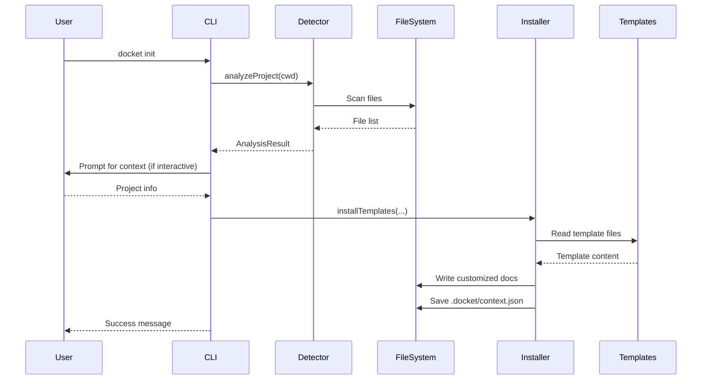

# Architecture Overview: Docket

**Version:** 0.3.0
**Last Updated:** 2025-10-11
**Status:** Current
**Audience:** Contributors, Developers, Agent Integrators

## Executive Summary

Docket is a documentation platform that combines production-ready templates with intelligent CLI tools and an agent-agnostic protocol. It helps developers initialize, maintain, and improve project documentation through automated analysis, gap detection, and drift monitoring.

The system consists of four main components: a command-line interface built with oclif, core analysis libraries written in TypeScript, 11 comprehensive documentation templates, and a JSON-based protocol for AI agent integration.

**Key Points:**
- **CLI-first design** - All functionality accessible via `docket` commands
- **Agent-agnostic architecture** - Works with any AI coding assistant through JSON protocol
- **Intelligent analysis** - Automatically detects languages, frameworks, and documentation gaps
- **Zero coupling** - No dependencies on specific agents or platforms

## System Context

### Purpose

Docket solves the documentation maintenance problem. Most software projects have non-existent, outdated, or scattered documentation. Docket addresses this by:

1. **Initializing documentation** - Smart setup based on project analysis
2. **Finding gaps** - Automated detection of missing or incomplete documentation
3. **Detecting drift** - Monitoring for staleness and code/documentation misalignment
4. **Enabling agents** - Providing structured data for AI-assisted documentation

### Users

Primary user types:

- **Solo Developers** - Individual developers documenting personal or portfolio projects
- **Development Teams** - Teams maintaining shared project documentation
- **Open Source Maintainers** - Projects needing contributor-friendly documentation
- **AI Coding Agents** - Automated assistants that help maintain documentation (Claude Code, Cursor, Aider, etc.)

### Dependencies

External dependencies:

- **Node.js** - Runtime (v18+)
- **npm** - Package manager
- **Git** (optional) - For staleness detection and revision tracking
- **File system** - Local project files for analysis

### Dependents

Systems that depend on docket:

- **User projects** - Documentation initialized and managed by docket
- **AI coding agents** - Agents consuming docket's JSON output for context
- **CI/CD pipelines** - Automated documentation checks in build processes

## Architecture Diagram

```
┌─────────────────────────────────────────────────────────┐
│                  Users / AI Agents                      │
└────────────────────────┬────────────────────────────────┘
                         │
                         ▼
┌─────────────────────────────────────────────────────────┐
│                 CLI Interface (oclif)                   │
│  ┌──────────┬──────────┬──────────┬──────────┐         │
│  │ analyze  │   init   │  audit   │  review  │         │
│  └──────────┴──────────┴──────────┴──────────┘         │
└────────────────────────┬────────────────────────────────┘
                         │
         ┌───────────────┼───────────────┐
         ▼               ▼               ▼
┌──────────────┐  ┌──────────────┐  ┌──────────────┐
│   Detector   │  │   Auditor    │  │   Reviewer   │
│              │  │              │  │              │
│ - Languages  │  │ - Coverage   │  │ - Staleness  │
│ - Frameworks │  │ - Gaps       │  │ - Drift      │
│ - Structure  │  │ - Scoring    │  │ - Health     │
└──────────────┘  └──────────────┘  └──────────────┘
         │               │               │
         └───────────────┼───────────────┘
                         ▼
                 ┌───────────────┐
                 │   Installer   │
                 │               │
                 │ - Templates   │
                 │ - Context     │
                 │ - Customize   │
                 └───────┬───────┘
                         │
         ┌───────────────┴───────────────┐
         ▼                               ▼
┌──────────────────┐           ┌─────────────────┐
│    Templates/    │           │  .docket-       │
│                  │           │   protocol/     │
│ 11 .md files     │           │                 │
│ (ADR, RFC, etc.) │           │ - agent-guide   │
│                  │           │ - schemas/      │
└──────────────────┘           └─────────────────┘
         │                               │
         └───────────────┬───────────────┘
                         ▼
                ┌─────────────────┐
                │  User's docs/   │
                │                 │
                │ Project-specific│
                │ documentation   │
                └─────────────────┘
```

## Components

### Component 1: CLI Layer (oclif)

**Purpose:** Command-line interface providing all docket functionality

**Technology:** oclif v4 (Node.js CLI framework)

**Responsibilities:**
- Parse command-line arguments and flags
- Provide rich terminal output (colors, formatting, progress)
- Generate JSON output for agent consumption (`--output json`)
- Handle interactive prompts (when appropriate)
- Display help and command documentation

**Key Commands:**
- `docket analyze` - Analyze project structure and technologies
- `docket init` - Initialize documentation with smart customization
- `docket audit` - Audit documentation completeness and find gaps
- `docket review` - Review documentation for staleness and drift

**Interactions:**
- Calls: Detector, Installer, Auditor, Reviewer libraries
- Called by: Users (terminal), AI agents (shell execution), CI/CD pipelines

**Key Interfaces:**
- Command execution: `./bin/run <command> [flags]`
- JSON output: `--output json` flag for structured data
- Non-interactive mode: `--non-interactive` for automation

**Deployment:**
- Distributed via npm: `npm install -g @tnezdev/docket`
- Can be run with npx: `npx @tnezdev/docket <command>`
- Executable scripts in `/bin` directory

---

### Component 2: Detector Library

**Purpose:** Analyzes project structure, languages, frameworks, and organization

**Technology:** TypeScript, Node.js `fs` module, `glob` library

**Responsibilities:**
- Detect programming languages by file extensions
- Identify frameworks through config file analysis (package.json, Cargo.toml, etc.)
- Analyze project structure (source/test/docs directories)
- Identify build tools and package managers
- Generate confidence scores for detections

**Interactions:**
- Called by: `analyze` command, `init` command (for context)
- Calls: File system APIs, glob pattern matching

**Key Interfaces:**
- `analyzeProject(cwd: string): Promise<AnalysisResult>`
- Returns structured data matching `analysis.schema.json`

**Deployment:**
- Compiled to `/lib/lib/detector.js` from `/src/lib/detector.ts`
- Bundled with npm package

---

### Component 3: Installer Library

**Purpose:** Installs and customizes documentation templates based on project context

**Technology:** TypeScript, Node.js `fs` module

**Responsibilities:**
- Copy templates from `/templates` to user's `docs/` directory
- Customize templates with project-specific information
- Save project context to `.docket/context.json`
- Skip existing files (idempotent installation)
- Handle template placeholder replacement

**Interactions:**
- Called by: `init` command
- Calls: File system APIs, template customization functions

**Key Interfaces:**
- `installTemplates(cwd, docsDir, customization): Promise<string[]>`
- `saveContext(cwd, context): void`
- `loadContext(cwd): ProjectContext | null`

**Deployment:**
- Compiled to `/lib/lib/installer.js` from `/src/lib/installer.ts`
- Accesses templates via relative path from lib directory

---

### Component 4: Auditor Library

**Purpose:** Audits documentation completeness and identifies gaps

**Technology:** TypeScript, Node.js `fs` module, `glob` library

**Responsibilities:**
- Scan documentation directory for markdown files
- Check coverage for key documentation types (architecture, ADRs, testing, etc.)
- Identify empty or placeholder-only files
- Validate ADR format compliance
- Calculate completeness score (0-100)
- Generate prioritized gap recommendations

**Interactions:**
- Called by: `audit` command
- Calls: File system APIs, pattern matching, analysis result from Detector

**Key Interfaces:**
- `auditDocumentation(cwd, docsDir, analysis): Promise<AuditResult>`
- Returns structured data matching `audit.schema.json`

**Deployment:**
- Compiled to `/lib/lib/auditor.js` from `/src/lib/auditor.ts`

---

### Component 5: Reviewer Library

**Purpose:** Reviews documentation for staleness and drift from codebase

**Technology:** TypeScript, Node.js `fs` module, Git CLI, `glob` library

**Responsibilities:**
- Detect stale documentation (files not updated in months)
- Check for code/documentation drift (code changes without doc updates)
- Verify framework alignment (docs match detected frameworks)
- Calculate health score (0-100)
- Generate recommendations for improvement

**Interactions:**
- Called by: `review` command
- Calls: File system APIs, Git commands, analysis result from Detector

**Key Interfaces:**
- `reviewDocumentation(cwd, docsDir, analysis): Promise<ReviewResult>`
- Returns structured data matching `review.schema.json`

**Deployment:**
- Compiled to `/lib/lib/reviewer.js` from `/src/lib/reviewer.ts`

---

### Component 6: Templates Collection

**Purpose:** Production-ready documentation templates for common project needs

**Technology:** Markdown files with placeholder syntax

**Responsibilities:**
- Provide structure and guidance for documentation
- Include examples and best practices
- Support customization via placeholder replacement
- Cover diverse documentation needs (ADRs, RFCs, runbooks, etc.)

**Templates:**
1. `adr-template.md` - Architecture Decision Records
2. `api-documentation-template.md` - API reference
3. `architecture-overview-template.md` - System architecture
4. `onboarding-template.md` - Developer onboarding
5. `patterns-template.md` - Code patterns catalog
6. `rfc-template.md` - Request for Comments
7. `runbook-template.md` - Operational procedures
8. `standards-template.md` - Coding standards
9. `testing-template.md` - Testing philosophy
10. `troubleshooting-template.md` - Problem diagnosis
11. `writing-software-template.md` - Development philosophy

**Deployment:**
- Source files in `/templates` directory
- Included in npm package via `files` field in package.json

---

### Component 7: Agent Protocol

**Purpose:** Enable AI coding agents to use docket through standardized interface

**Technology:** Markdown documentation, JSON Schema definitions

**Responsibilities:**
- Document integration patterns for agents
- Define JSON output schemas for all commands
- Provide workflow examples and best practices
- Ensure cross-agent compatibility

**Key Files:**
- `.docket-protocol/agent-guide.md` - Complete integration guide
- `.docket-protocol/schemas/analysis.schema.json` - Analyze output schema
- `.docket-protocol/schemas/audit.schema.json` - Audit output schema
- `.docket-protocol/schemas/review.schema.json` - Review output schema
- `.docket-protocol/schemas/init.schema.json` - Init output schema

**Interactions:**
- Read by: AI agents, agent developers, integration maintainers
- No runtime dependencies

**Deployment:**
- Included in npm package and Git repository
- Served from GitHub for online access

## Data Flow

### Primary Flow: Smart Initialization

1. **User executes:** `docket init`
2. **CLI parses:** Command and flags (interactive vs non-interactive)
3. **Detector analyzes:** Project structure, languages, frameworks
4. **CLI prompts:** (if interactive) Project name, team size, documentation goals
5. **Installer customizes:** Templates based on analysis and user input
6. **Installer creates:** Documentation files in `docs/` directory
7. **Installer saves:** Context to `.docket/context.json`
8. **CLI displays:** Success message with next steps

**Sequence Diagram:**



### Secondary Flow: Documentation Audit

1. **User/Agent executes:** `docket audit --output json`
2. **CLI parses:** Command and flags
3. **Detector analyzes:** Project (for context)
4. **Auditor scans:** Documentation directory
5. **Auditor checks:** Coverage, empty files, ADR compliance
6. **Auditor calculates:** Completeness score and gaps
7. **CLI outputs:** JSON result to stdout

### Tertiary Flow: Drift Detection

1. **User executes:** `docket review`
2. **Detector analyzes:** Current project state
3. **Reviewer checks:** Git history for file modifications
4. **Reviewer compares:** Detected frameworks vs documented frameworks
5. **Reviewer identifies:** Stale files and drift issues
6. **Reviewer calculates:** Health score
7. **CLI displays:** Formatted review results

## Technology Stack

### Core Runtime
- **Language:** TypeScript 5.x
- **Runtime:** Node.js 18+
- **Package Manager:** npm

### CLI Framework
- **Framework:** oclif v4
- **Reason:** Rich UX, TypeScript-first, proven at scale (see ADR-0002)

### Build & Development
- **Compiler:** TypeScript compiler (`tsc`)
- **Testing:** Mocha v10
- **Linting:** ESLint v8 (via oclif config)

### Core Libraries
- **File Operations:** Node.js `fs` module
- **Pattern Matching:** `glob` v10
- **Terminal Colors:** `chalk` v4
- **Interactive Prompts:** `inquirer` v8

### Distribution
- **Registry:** npm
- **Package Name:** `@tnezdev/docket`
- **Binary:** Installed to `node_modules/.bin/docket`

### Documentation
- **Format:** Markdown
- **Schema Definitions:** JSON Schema (draft-07)

## Scalability

### Current Scale
- **Installation size:** ~717 npm packages (including transitive dependencies)
- **Compiled size:** ~2 MB lib directory
- **Template count:** 11 markdown files
- **Supported languages:** 30+ (extensible)
- **Supported frameworks:** 50+ (extensible)

### Performance Characteristics
- **Analysis time:** < 2 seconds for typical projects
- **Init time:** < 1 second (template installation)
- **Audit time:** < 1 second for typical documentation
- **Review time:** 1-3 seconds (depends on Git history size)

### Scaling Strategy

**Not Applicable** - Docket is a CLI tool that runs locally. Scaling is handled by:
- Individual user machines (no central service)
- npm CDN for package distribution
- GitHub for source code and protocol documentation

## Security

### Local Execution Model
- **No network calls** - All analysis is local file system only
- **No data transmission** - No telemetry or analytics
- **No credentials** - Doesn't handle secrets or authentication

### File System Access
- **Read access:** Scans project files for analysis
- **Write access:** Creates docs/ directory and .docket/ context
- **Permissions:** Respects standard file system permissions
- **Safety:** Idempotent operations (won't overwrite existing files)

### Supply Chain
- **Dependencies:** Managed via npm with package-lock.json
- **Audit:** Regular `npm audit` for vulnerability scanning
- **Source:** All code open source on GitHub

## Resilience

### Error Handling
- **Graceful failures:** Commands fail with clear error messages
- **Validation:** Input validation for all user-provided data
- **Rollback:** Idempotent operations mean retries are safe

### Compatibility
- **Cross-platform:** Works on macOS, Linux, Windows
- **Node versions:** Requires Node.js 18+
- **Backward compatible:** Shell scripts still work for template-only users

## Performance

### Benchmarks
- **Cold start:** < 500ms (first run with ts-node)
- **Warm start:** < 100ms (subsequent runs)
- **Large projects:** Scales to 10,000+ files without issues

### Optimization Strategies
- **Glob patterns:** Ignore common paths (node_modules, .git, dist)
- **Lazy loading:** Only load libraries when needed
- **Compiled output:** Use compiled JS in production (not ts-node)
- **Caching:** Reuse analysis results when appropriate

## Deployment

### Distribution Method
**npm Package** - Published to npm registry as `@tnezdev/docket`

### Installation Options
```bash
# Global installation
npm install -g @tnezdev/docket

# Use without installation
npx @tnezdev/docket <command>
```

### Build Process
```bash
# Development (ts-node)
./bin/run <command>

# Production build
npm run build  # Compiles src/ to lib/

# Package for npm
npm pack       # Creates tarball
npm publish    # Publishes to registry
```

### Versioning
- **Semantic versioning:** MAJOR.MINOR.PATCH
- **Current version:** 0.3.0 (pre-1.0 alpha)
- **Breaking changes:** Will bump major version

## Future Considerations

### Near Term (Next Release)
- **Plugin system** - Allow custom templates and analyzers
- **More languages** - Expand language detection (Elixir, Zig, V, etc.)
- **Cache layer** - Cache analysis results for faster subsequent runs
- **Watch mode** - Monitor files and re-audit on changes

### Long Term (Post 1.0)
- **Custom templates** - User-provided template repositories
- **Integration tests** - Test against real agent frameworks
- **VS Code extension** - Native editor integration
- **GitHub Action** - Run audit in CI/CD pipelines
- **Web dashboard** - Optional hosted dashboard for teams

## Decision Log

Key architectural decisions documented in ADRs:

- [ADR-0001: CLI Platform Over Templates-Only](./adr-0001-cli-platform-over-templates-only.md) - Core transformation decision
- [ADR-0002: Use Oclif for CLI Framework](./adr-0002-oclif-for-cli-framework.md) - Technical framework choice
- [ADR-0003: Agent-Agnostic Architecture](./adr-0003-agent-agnostic-architecture.md) - Integration philosophy

## References

- [Agent Protocol Guide](../.docket-protocol/agent-guide.md) - How agents integrate with docket
- [JSON Schemas](../.docket-protocol/schemas/) - Output format specifications
- [README](../README.md) - Project overview and quick start
- [Contributing Guide](../CONTRIBUTING.md) - How to contribute to docket
- [oclif Documentation](https://oclif.io/) - CLI framework we use

## Glossary

- **ADR:** Architecture Decision Record - Document capturing a significant decision
- **Agent:** AI coding assistant (Claude Code, Cursor, Aider, etc.)
- **CLI:** Command Line Interface
- **Drift:** Misalignment between code and documentation
- **Idempotent:** Operation that produces same result regardless of how many times executed
- **Staleness:** Documentation that hasn't been updated recently
- **Template:** Pre-structured markdown file with placeholders and guidance

---

**This architecture overview documents docket's current implementation as of v0.3.0. It reflects the transformation from templates-only to a complete documentation platform with intelligent CLI and agent protocol.**
